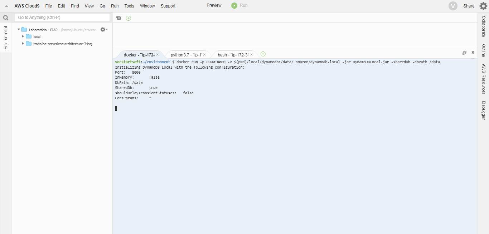
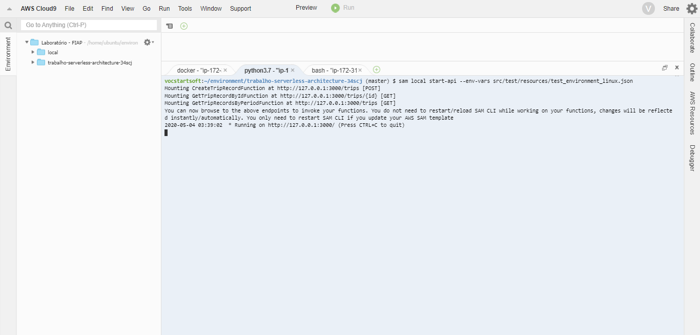
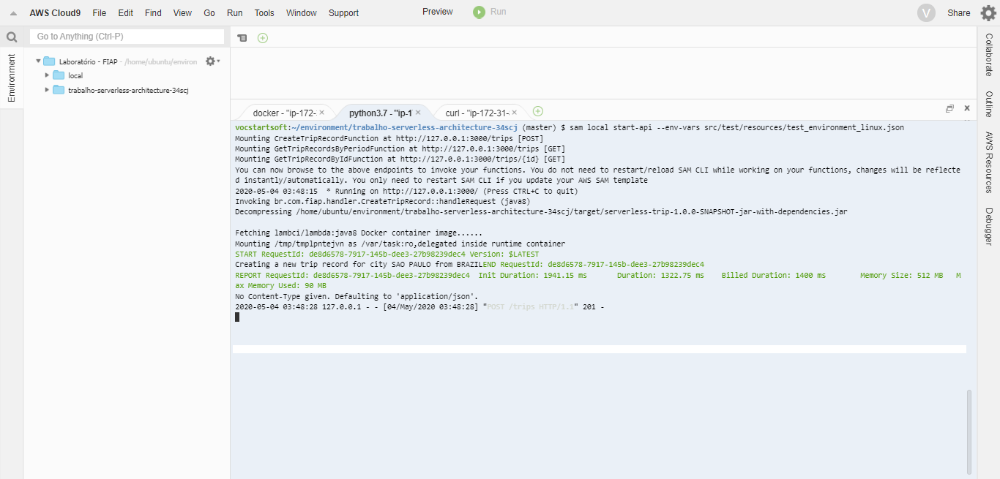
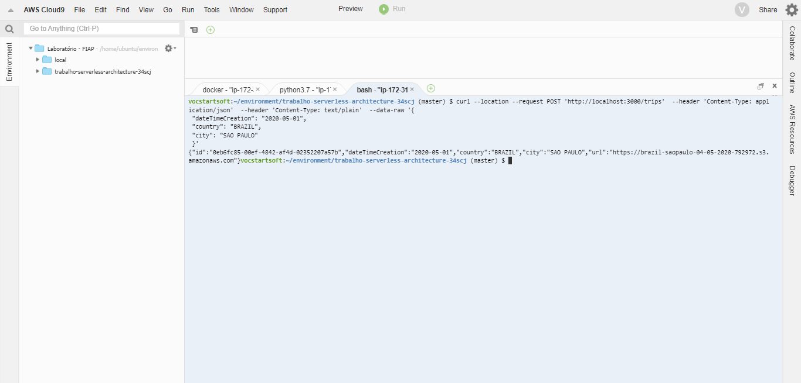
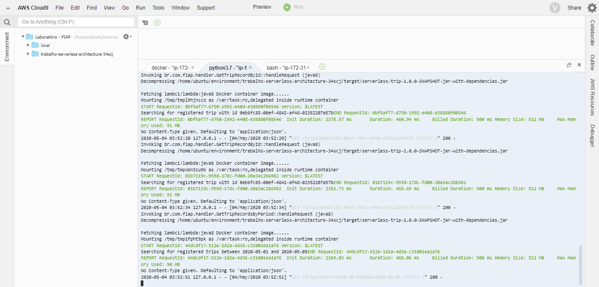
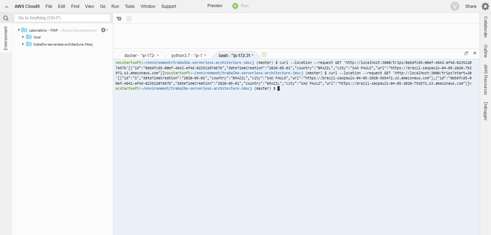
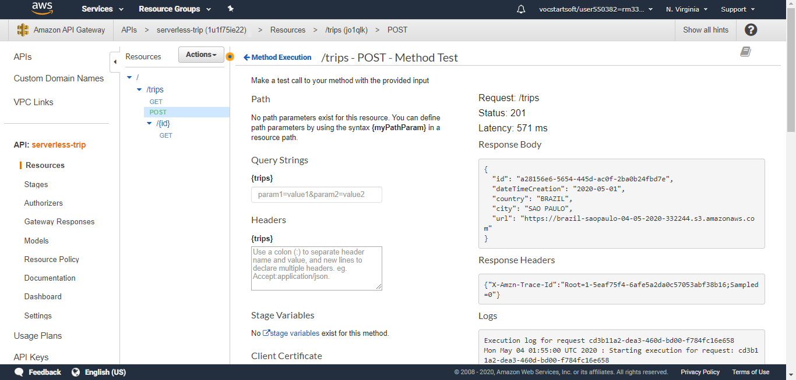
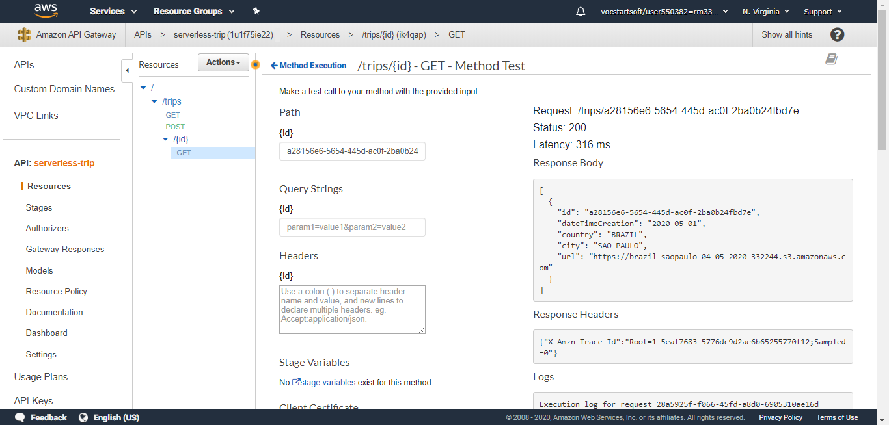
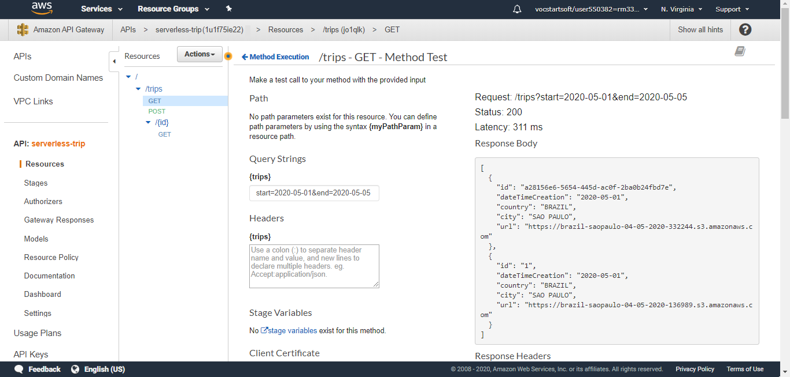

# Trabalho da disciplina de Serverless Architecture 34SCJ.
**Aluno:** Bruno Delphino Zambotti (RM 334242)

**Professor:** Peterson de Oliveira Larentis.

**Descrição:** Projeto do trabalho final da disciplina de Serverless Architecture da turma 34SCJ da FIAP.

## Evidências dos testes locais.

  

## Evidências dos testes via api gateway.

  

