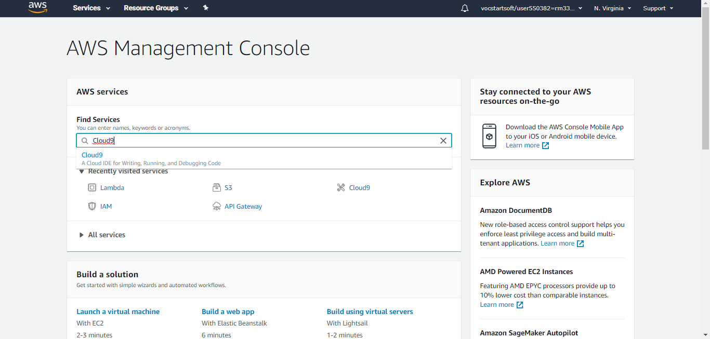
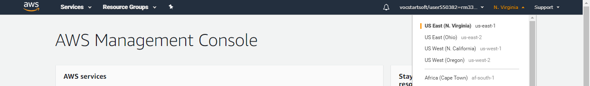
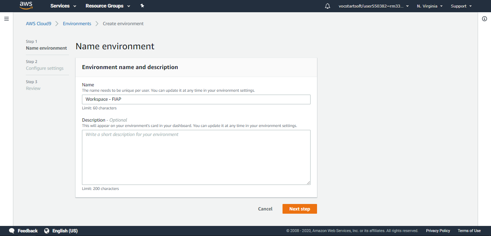
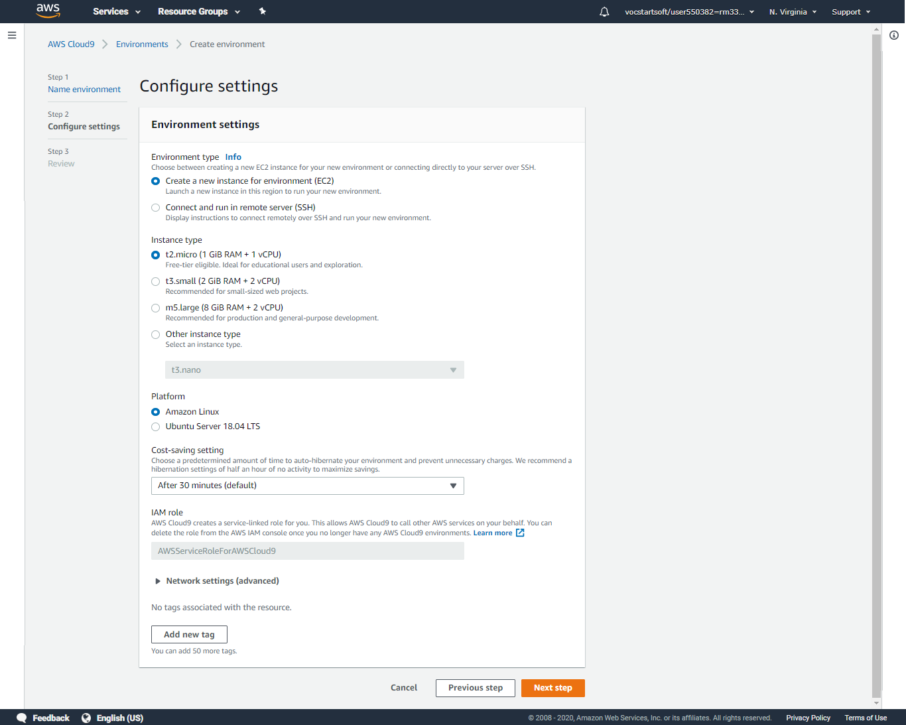
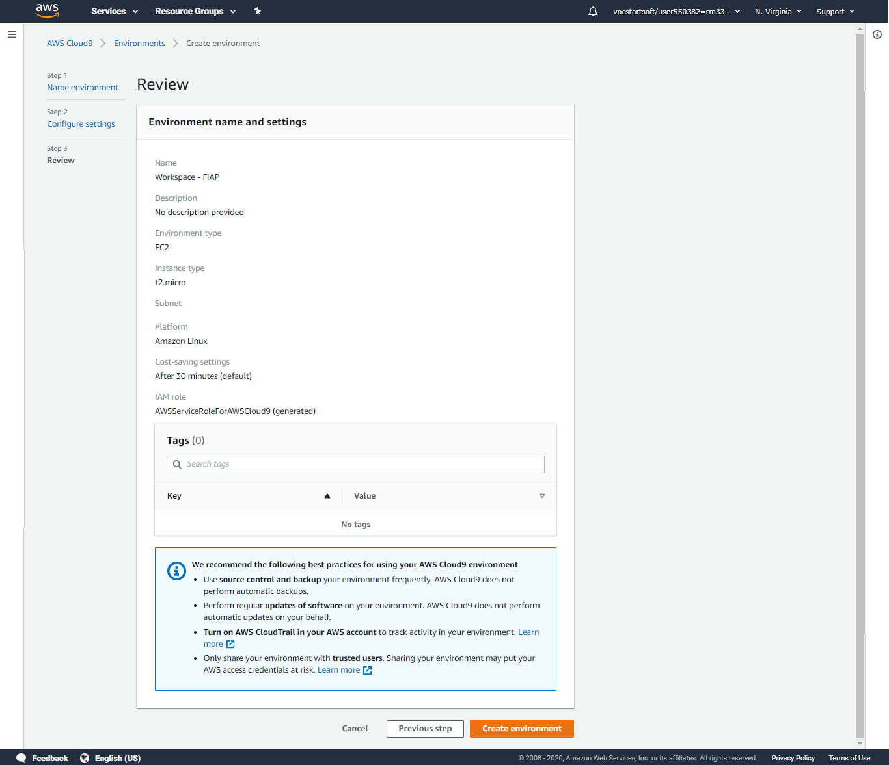
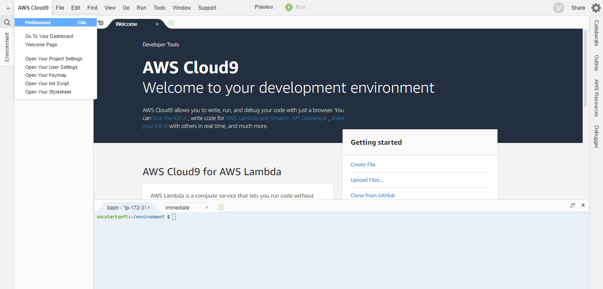
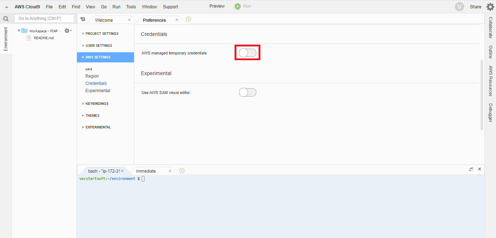
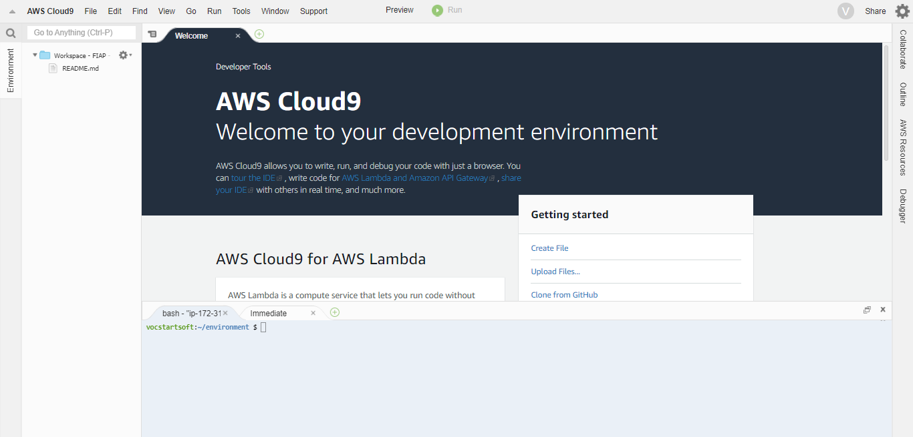
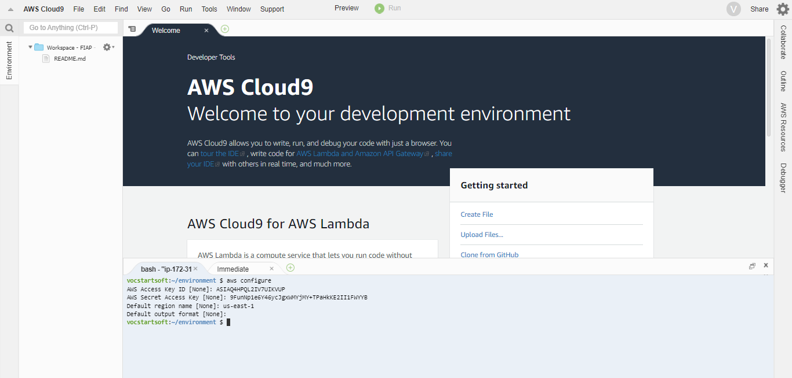

# Trabalho da disciplina de Serverless Architecture 34SCJ.
**Aluno:** Bruno Delphino Zambotti (RM 334242)

**Professor:** Peterson de Oliveira Larentis.

**Descrição:** Projeto do trabalho final da disciplina de Serverless Architecture da turma 34SCJ da FIAP.

## Passos para configuração do ambiente do Cloud 9.

1. Abra o console da AWS e na barra de pesquisa digite `Cloud9`:

   
2. Certifique-se de que a região utilizada é `us-east-1`:

3. Após abrir a tela principal do serviço `Cloud9` clique na opção `create environment`:

4. Informe o nome de sua preferência exemplo: `Workspace - FIAP` e em seguida clique em `Next Step`:

5. Não é necessário mudar nenhuma das configurações pré-definidas, de qualquer forma segue exemplo abaixo:

6. Em seguida clique na opção `Create environment`:

7. A criação do ambiente pode levar alguns minutos:

8. Após o carregamento da IDE do Cloud9 clique em 'AWS Cloud9' no canto superior esquerdo e escolha a opção 'Preferences':

9. Em seguida clique na opção 'AWS SETTINGS' no menu lateral e desabilite a função 'AWS managed temporary credentials':

10. Para execução dos próximos comandos utilize o terminal que fica no canto inferior da IDE do Cloud9. Importante: Para execução deste passo você já deve ter posse das credenciais AWS IAM que serão utilizadas.

11. Utilize o comando `aws configure` para atribuir as credenciais de acesso. Importante informe o valor `us-east-1` na opção `Default region name`:

12. Caso deseje informar mais alguma informação no arquivo de credenciais, utilize o comando `nano ~/.aws/credentials` para adicionar valores.

13. Após as alterações, salve o arquivo pressionando as teclas 'CTRL + X' e logo em seguida na mensagem de confimação informe 'Y', por fim pressione a tecla enter para finalizar a edição.
